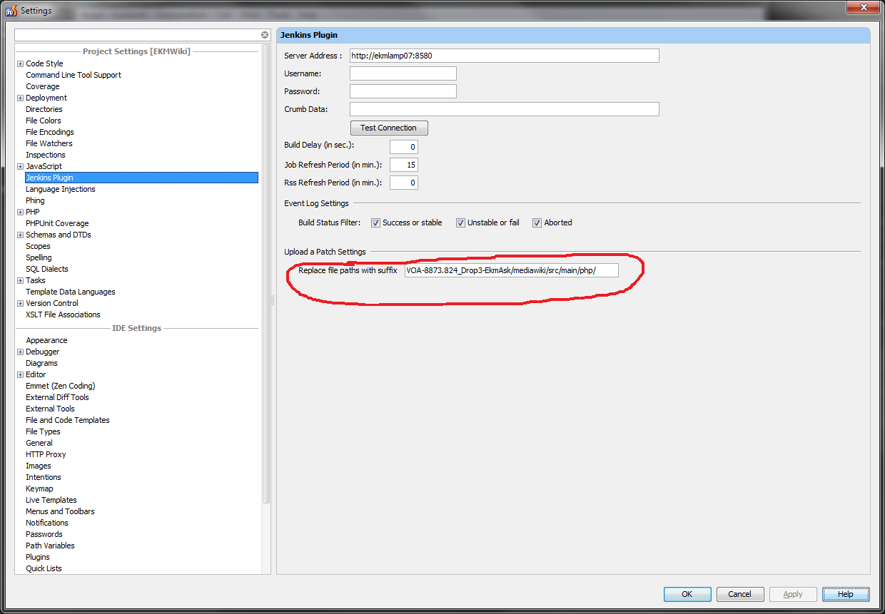

# Jenkins Plugin 0.11.0 for Jetbrains products

* [Jetbrains plugin page](https://plugins.jetbrains.com/idea/plugin/6110)
* [Changelog](CHANGELOG.txt)

### Current build
* [Idea 2019](snapshot/jenkins-control-plugin-0.11.0-SNAPSHOT.zip)

## Description
This plugin allows to view the content of your Jenkins Continous Integration Server.

## Plugin Compatibility
This plugin was built with JDK 1.7 for IDEA 14, 15 and with JDK 8 for IDEA 2016, 2019 versions. Jenkins CIs of jenkins-ci and apache.org are used for manual and stress testing.

## Installation steps
Download this plugin from your IDE or [from the plugin website](http://plugins.jetbrains.com/plugin/6110).

## Configuration steps
* Click on the **Jenkins Settings** button located on the upper toolbar (or you can also open IntelliJ Settings Screen and select the Jenkins Control Plugin option).
* Enter your Jenkins Server URL (e.g: http://ci.jenkins-ci.org).
* If Security is enabled on the server, you have to provide credentials. Enter your username and the password. The password will be stored in Intellij Password Manager. It could ask you a Master password.
* If Cross Site Request Forgery Prevention is enabled on the server, then you have to provide your crumb data. To get the value, you will have to open the following URL in your browser *_jenkins_url_/crumbIssuer/api/xml?tree=crumb*. Just copy and paste the crumb value in the field. please note for the authentication case, you have to run the crumb URL after login.
* To make sure that all parameters are correct, you can click on the **Test Connection** button. A feedback message will appear.

* If the server response is 401 or 403, a debug panel will appear below :

* You can specify a build start delay (in sec.).
* You can set an auto refresh Period value (in minutes) for both Job Browser and Rss Reader.
* You can filter the RSS data based on the status of the build
* When your configuration is set up, click on the **Apply** Button to save it.

## Usage
* To view the jobs You have to refresh the Jenkins Workspace by right-clicking on the Server icon node
* You can select some view by selecting of them in the combo box.
* When you right click on a job some options are available such as Launch a Build, View The Job's Page and View the Last Build Results.
* You can sort builds by status (Fail, Unstable, Disabled/Cancelled and Success)

* To search specific Job, just start typing in the Browser and use UP and DOWN keys to navigate.

* You can set some jobs as favorite.

* A new View will appear in the combobox that will include your selected jobs.

### RSS Reader
The RSS reader has moved to the Event Log. If you need to refresh manually, click on the Rss icon button.

### Widget
* A small widget is available on the status bar. It indicates the overall status of the selected view. When there is no broken build then the icon color is blue (else, a red icon is displayed with the remaining broken builds. If the job auto-refresh is enabled then the widget updates itself.

### Patch Parameter Plugin Support (Pre-tested commit) by [Yuri Novitsky](https://github.com/nyver)
* (https://wiki.jenkins-ci.org/display/JENKINS/Patch+Parameter+Plugin)
* Information about pre-tested commit: https://wiki.jenkins-ci.org/display/JENKINS/Designing+pre-tested+commit

* **Setup the plugin from Jenkins server**

1. Install Patch Parameter Plugin in Jenkins 
2. Setup Jenkin's job for patch support 
3. Before each new build we need to rollback the patch changes with "revert" operation 

* **Setup from the IDE**

1. Updating the list of jobs i recommend to install in 1 minute for quick notifications of the results of the build 
2. That's all. Now you can run builds with local changes directly from the IDE  
3. Build status is displayed near the name of the changelist 

## How to build

This project is built with Gradle. Just run `./gradlew buildPlugin`.

### Open the plugin source in Intellij

Import the plugin as Gradle project into IntelliJ.

### Run Intellij from IntelliJ

Create a Gradle Run configuration with task `runIdea` and just run it.

## Limitations
* This software is written under Apache License 2.0.
* if Jenkins is behing an HTTPS web server, set a **trusted** certificate.

## Thanks
I would like to thank:
* All Github contributors who fixed the plugin for Jenkins 2
* [David Boissier](https://github.com/dboissier) for develop and maintain the plugin in the last years
    * His wife and his daughters who support him to have fun in software development and also remind him the husband/father duty ;).
* [Cezary Butler](https://github.com/cezary-butler) and **Marcin Seroka** from [Programisci](http://programisci.eu/en/) for their contribution to fix and improve this plugin for Idea 14 and 15
* [Yuri Novitsky](https://github.com/nyver) for his contribution to this plugin (pre-commit feature)
* Kohsuke Kawaguchi for providing us such a great CI server
* Jetbrains Team for providing us such an incredible IDE (certainly the best that Java developers could have).
* All users who sent valuable suggestions
* Mark James author of the famfamfam web site who provides beautiful icons.
* Guys from Lex Group : Boris Gonnot, Regis Medina, Sébastien Crego, Olivier Catteau, Jean Baptiste Potonnier and others Agile ninjas.
* Icon is from [Jenkins Artwork](https://jenkins.io/artwork/)
